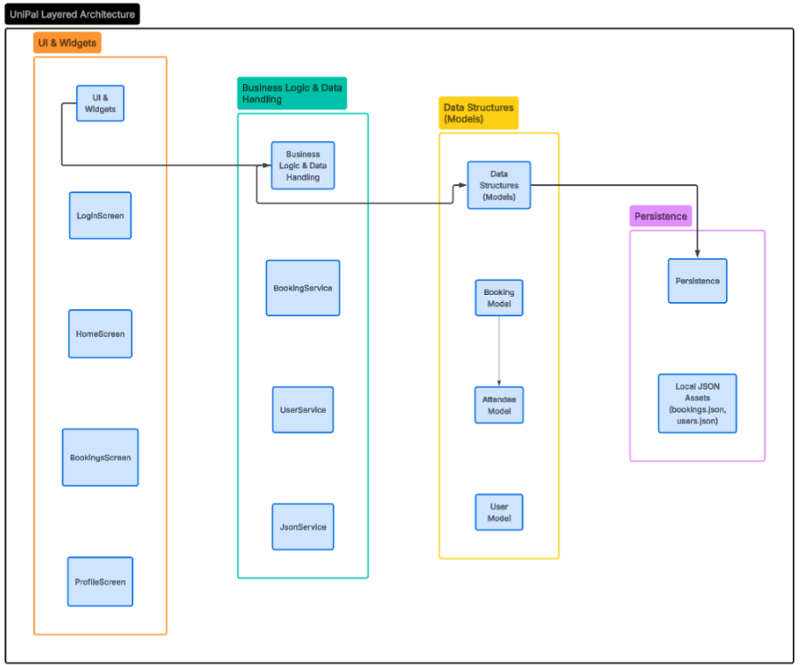

============================
SETAP Coursework Iteration 2
============================

**Team ID:** 1D, Kritika, Kirill, Reem and David

Specification
=============

**Initial Requirements:** Users should be able to see buildings that are available to study in.

* **Changes made to the system requirement:** Users being able to see buildings was reformatted to be included in "bookings" rather than a standalone option of users seeing which building was available before committing to a booking.
* **Rationale for the changes:** We aimed for better functionality of how users would be able to see which buildings were available. This allowed for better streamlining.
* **Implementation progress:** The building names were assigned to each building by using JSON files, and those building names would be available to see in the drop-down menu. Each ID is uniquely assigned to each building, with service relaying that back into buildings. The Building SelectionPage loads all 20 university buildings from building.json and displays each as a card showing the building name, available amenities (café, elevator, helpdesk), room count, and floor count.
* **Testing progress:** We tested the functionality of this user requirement by conducting a dummy test of booking a room. Once you click 'booking' button, there will be a 'building selection' with a drop down menu of different buildings available to book from. The Building SelectionPage group in screens_widget_test.dart covers eight test cases including the loading state, real building names from JSON.

**Initial requirement:** Users should be able to see revision resources.

* **Changes made to the system requirement:** No changes were conducted with users sharing revision resources
* **Rationale for the changes:** No changes were made
* **Implementation progress:** This requirement has not yet been implemented in the current database. There is no dedicated revision resources feature present in the application. The home dashboard contains placeholder tiles (Notes, Files, Upload) which could eventually support this, but no actual revision resource functionality exists at this stage.
* **Testing progress:** As of testing, users cannot access nor upload any revision files.

**Initial requirement:** Users should be able to edit a booking.

* **Changes made to the system requirement:** No changes were made
* **Rationale for the changes:** No changes were made
* **Implementation progress:** An EditBooking Page class exists in bookings_screen.dart and provides a user interface for editing the title, building, room, date, time, and number of attendees for an existing booking. The classes of buldingservice, building and room are defined and referenced.
* **Testing progress:** We used the widget tester to initiate the interaction with the widget in the test environment which was successful. User can input the time, day and month in the booking to edit the booking and reconfirm it.

**Initial requirement:** Users should be able to book a room.

* **Changes made to the system requirement:** No change
* **Rationale for the changes:** No change
* **Implementation progress:** The BookingStepperPage provides a booking flow covering building selection, room selection, booking details (date, time, number of people), and a confirmation step. Building and room data is loaded from building.json, and a room uniqueness constraint ensures rooms are exclusive to their assigned building. Confirmed bookings are saved via BookingService.
* **Testing progress:** The BookingStepperPage group in screens_widget_test.dart covers nine test cases including loading state, step navigation, validation SnackBars, the JSON-driven building dropdown, the room uniqueness constraint, building change resetting room selection, and back navigation.

Design
======

The architecture of the room booking application has changed a lot from the design in December to the current implementation. The original model represented a high level, conceptual client server system. In contrast, the new reverse engineered model reflects a highly structured, localized four tier layered architecture:

* UI & Widgets
* Business Logic & Data Handling
* Data Structures
* Persistence

The initial design utilized broad infrastructure abstractions and generic functional nodes. The current architectural model replaces these conceptual nodes with concrete software modules, such as BookingService, JsonService and BookingModel.  

The original diagram depicted a centralized, funnel-like relationship where multiple distinct functional nodes all routed directly through a single DBConnector to reach the database. The current architecture employs decoupled, layered relationships. Dependencies now flow strictly downward (Presentation -> Service -> Domain -> Persistence), establishing a flow that prevents tight coupling between the user interface and the data structures.  

The architectural pattern has changed. The original diagram illustrates a traditional Three Tier client server pattern designed for remote database interaction. Because the application now operates using localized data, the pattern has shifted to a Layered Application Architecture. The remote server logic has been fully absorbed into localized service and domain classes. Several components have been split into distinct sub components to improve modularity. 

* **Feature Decomposition:** The broad "Booking" and "Calendar" concepts from the original model have been separated into Ul rendering (BookingScreen, business logic orchestration (Booking Service), and data modelling.
* **Data Decomposition:** Within the data modelling itself, the general booking concept was further divided into nested domain objects, creating a separate attendee subcomponent to manage participants independently from the core booking data.

Merging also has occurred, in the original client Server model, the system required separate blocks for the server, DBConnector, and the database itself. In the current localized application architecture, these distinct physical and networking tiers have been merged into a single, unified Persistence Layer. JsonService is assigned to handle data extraction, whilst JSON asset files such as bookings.json or user.json, are consolidated databases, this removes the need for complex connector components.

Implementation
==============

* **Link to video demo:** <insert link to a 3-5 minute demo of your prototype>
* **Link to GitHub repository:** https://github.com/DMichael56/UniPal.git iacobcl
* **Link to code documentation (readthedocs):** <insert link to a built version of your code documentation>
* **Link to test plan:** https://portdotacdotuk-my.sharepoint.com/:x:/r/personal/up2267885_myport_ac_uk/_layouts/15/Doc.aspx?sourcedoc=%7BC7B7A548-1974-4278-8B39-B766D30E785A%7D&file=Test%20Plan%201D%20SUB.xlsx&action=default&mobileredirect=true: Editing right has been granted to iacobcl
* **Link to automated tests and evidence of a test report:** The test report is in the Github repository as a word document

Critical analysis
=================

Provide examples of teamwork management in terms of:

* **Leadership:** Leadership was transitioned into an equal collaborative effort by holding each other accountable with tasks that we delegated amongst ourselves, pre-scheduling meetings to fit everybody's calendar schedule and offer any assistance in the coding phase if team members were struggling.
* **Progress monitoring:** Our approach did not necessarily change but adapted to seeing the progression of the app via Github since everybody had access to the repository. We had a WhatsApp group chat where we would inform each other with the current progress or problems we faced in the implementation of the application.
* **Conflict resolution:** One conflict resolution we faced was splitting the original team in half. We were in constant communication with our lecturer and attempted to showcase that we could function as a full team. Unfortunately, we failed to meet that expectation, so we had ultimately decided to split the team. This allowed us to gain a better understanding of accountability, team effort and communication to develop our application.

Contributions table
===================

.. list-table:: 
   :widths: 33 33 34
   :header-rows: 1

   * - Team Member
     - Contributions Overall (%)
     - Signature
   * - UP2304778
     - 25%
     - David
   * - UP2270236
     - 25%
     - Reem
   * - UP2268507
     - 25%
     - Kirill
   * - UP2267885
     - 25%
     - Kritika